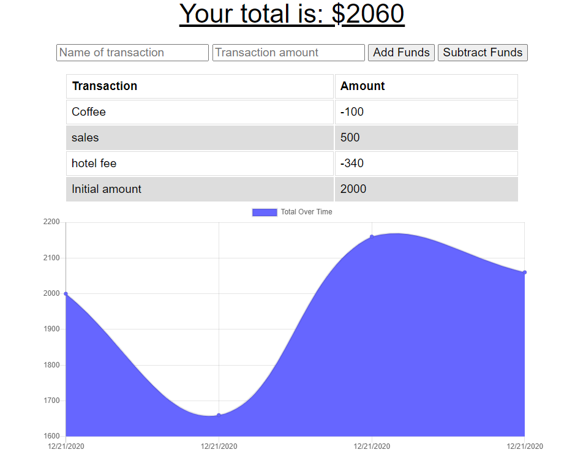

# Budget tracker

App link: https://blooming-plains-58293.herokuapp.com/ 

## Description

This is a app to keep track of your budget. If your internet disconnects while using the app, it will store the data and update the transactions once internet connectivity is resumed. It will provide notifications during each transaction, as well as the status of the internet.

This is a PWA app, allow you to install directly onto your device. It's hosted on Heroku with MongoDB atlas service, allow it to be accessed anywhere. 